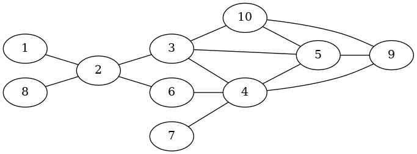
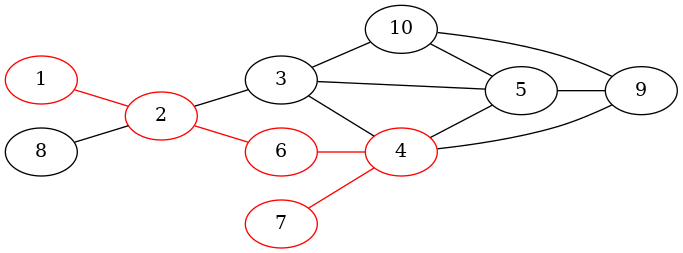

# nctx - Networks in ConTeXt

<!-- badges: start -->
<!-- badges: end -->

The extension `nctx` provides functionality to analyze attributed networks. Unique feature of this extension is the ability to enforce contextual constraints via user-defined functions during shortest path discovery and centrality calculation. More info and full documentation can be found [here](https://nctx.mircoschoenfeld.de/R/)

## Installation

You can install the released version of nctx from [github](https://github.com/nctx/rnctx) with:

```{r, eval=FALSE}
library(devtools)
install_github("nctx/rnctx")
```

## Example

This is a basic example of how to process attributed networks. For the creation of the graph, there are three choices: create the graph from scratch, load it from a file (in the [GraphML](https://en.wikipedia.org/wiki/GraphML) format), or copy it from [igraph](https://igraph.org/r/).

This example shows how to do things from scratch.
```r
require(nctx)

g <- create_graph(directed=FALSE)

# This instantiates the network proposed in
# Ulrik Brandes, Jan Hildebrand: Smallest graphs with distinct singleton centers, 
# Network Science 2 (2014), 3., S. 416-418
sapply(1:10,function(x){add_vertex(g)})
add_edge(g, 1, 2)
add_edge(g, 2, 3)
add_edge(g, 3, 4)
add_edge(g, 4, 5)
add_edge(g, 3, 5)
add_edge(g, 5, 9)
add_edge(g, 6, 4)
add_edge(g, 7, 4)
add_edge(g, 2, 6)
add_edge(g, 8, 2)
add_edge(g, 9, 4)
add_edge(g, 3, 10)
add_edge(g, 10, 5)
add_edge(g, 10, 9)
```



Next to our graph we create a list of attributes or context information
```r
context <- c(1,1,0,1,1,1,1,0,1,0)
```

This is a very simple example of a `bool`-attriute associated with each node (the third entry in this list yields the attribute of the third vertex in `g` and so on).

The unique feature of `nctx` comes here: **Define a function that is evaluated at each node during shortest path discovery**. Therefore, the function has to accept three parameters: the start vertex, the current, and the next vertex. It must evaluate to bool in order to guide edge traversal. 
```r
decision_fct <- function(strt, crnt, nxt){
  context[crnt] == context[nxt]
}
```

Here, we use an edge only if its source and end vertex have the same context information assigned:
```r
path <- find_path_ctx(g, 1, 7, decision_fct)
```



The shortest path from `1` to `7` is:
```
[1] 1 2 6 4 7
```
The edge `2` -> `3` was not visited because of contextual constraints: `context[2] != context[3]`.

For this example of shortest path discovery from start to target, passing the start vertex to the decision function is unnecessary. However, the signature of this function is consistent for all shortest-path- and centrality-related functionality. It becomes clear for the discovery of **all** shortest paths in the network. Here, we need the start vertex to know the vertex for which shortest paths are discovered:
```r
distances <- all_pairs_shortest_paths_ctx(g, decision_fct)
```

The result is a distance matrix:
```
      [,1] [,2] [,3] [,4] [,5] [,6] [,7] [,8] [,9] [,10]
 [1,]    0    1  Inf    3    4    2    4  Inf    4   Inf
 [2,]    1    0  Inf    2    3    1    3  Inf    3   Inf
 [3,]  Inf  Inf    0  Inf  Inf  Inf  Inf  Inf  Inf     1
 [4,]    3    2  Inf    0    1    1    1  Inf    1   Inf
 [5,]    4    3  Inf    1    0    2    2  Inf    1   Inf
 [6,]    2    1  Inf    1    2    0    2  Inf    2   Inf
 [7,]    4    3  Inf    1    2    2    0  Inf    2   Inf
 [8,]  Inf  Inf  Inf  Inf  Inf  Inf  Inf    0  Inf   Inf
 [9,]    4    3  Inf    1    1    2    2  Inf    0   Inf
[10,]  Inf  Inf    1  Inf  Inf  Inf  Inf  Inf  Inf     0
```

Since the decision function receives IDs of vertices, we can complicate our attribute data structure to contain vectors for each vertex:
```r
set.seed(42)
context <- list("1" = rnorm(100),
                "2" = rnorm(100),
                "3" = rnorm(100),
                "4" = rnorm(100),
                "5" = rnorm(100),
                "6" = rnorm(100),
                "7" = rnorm(100),
                "8" = rnorm(100),
                "9" = rnorm(100),
                "10"= rnorm(100))
```
Then, the decision function needs to be adapted to this new data structure:
```r
decision_fct <- function(strt, crnt, nxt){
  dist_angular_distance(context[[crnt]], context[[nxt]]) <=
    dist_angular_distance(context[[strt]], context[[nxt]])
}
```
This decision function makes use of built-in distance functions for numeric vectors. Using this, we could evaluate the betweenness centrality, for example:
```r
betw <- betweenness_ctx(g,decision_fct)
```
It results in the following betweenness values for the vertices:
```
 [1] 0.0000000 3.3750000 4.3333333 3.9583333 1.0416667 0.5000000 0.0000000 0.0000000 0.5833333 0.4583333
```

More examples can be found in the documentation of the functions - see [https://nctx.mircoschoenfeld.de/R/](https://nctx.mircoschoenfeld.de/R/)

## Citation

If you use the `nctx` package, please cite [the corresponding tech report](https://epub.uni-bayreuth.de/5677/):

```
Mirco Schoenfeld. nctx - Networks in ConTeXt. University of Bayreuth, 2021.
```

```
@techreport{2021-schoenfeld-nctx,
           month = {June},
     institution = {University of Bayreuth},
         address = {Bayreuth, Germany},
          author = {Mirco Schoenfeld},
           title = {nctx - Networks in ConTeXt},
            year = {2021},
        keywords = {network analysis, attributed networks, context-awareness, library, python, R, C++},
             url = {https://epub.uni-bayreuth.de/5677/}
}
```


